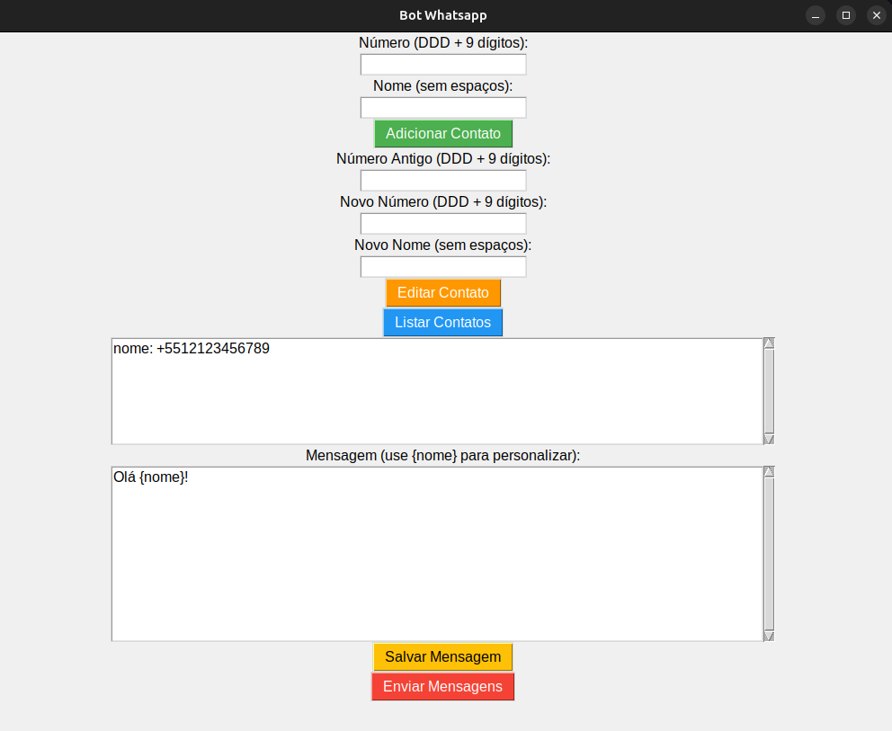

# Bot de WhatsApp

Este é um aplicativo simples desenvolvido com o Tkinter para automatizar o envio de mensagens no WhatsApp. O bot permite adicionar, editar e listar contatos, personalizar mensagens e enviar automaticamente para os contatos cadastrados.

## Funcionalidades

- **Adicionar Contato**: Adiciona um novo contato com número e nome.
- **Editar Contato**: Permite editar o número ou nome de um contato existente.
- **Listar Contatos**: Exibe todos os contatos cadastrados.
- **Mensagem Personalizada**: Permite criar e salvar uma mensagem personalizada com a tag `{nome}` para personalizar o envio.
- **Enviar Mensagens**: Envia as mensagens salvas para os contatos cadastrados.

## Como Usar

### Requisitos
Antes de usar o bot, você precisa ter o Python instalado em sua máquina, assim como as dependências necessárias.

1. **Instale o Python 3**:
   - [Windows](https://www.python.org/downloads/windows/)
   - [Linux](https://www.python.org/downloads/)

2. **Instalar as dependências**:
   Após instalar o Python, você deve instalar as dependências necessárias. Em seu terminal, execute:

   ```
   pip install -r requirements.txt
   ```

   **Observação**: O arquivo `requirements.txt` deve conter todas as bibliotecas necessárias, como `tkinter` e outras bibliotecas utilizadas no seu código.

### Passo a Passo

#### No Windows:
1. Baixe o arquivo do projeto ou clone o repositório com o comando:
   ```
   git clone https://github.com/lcsgborges/bot-whatsapp.git
   ```

2. Navegue até a pasta do projeto:
   ```
   cd caminho/para/o/projeto
   ```

3. Crie e ative um ambiente virtual (opcional, mas recomendado):
   ```
   python -m venv venv
   venv\Scripts\activate
   ```

4. Instale as dependências necessárias:
   ```
   pip install -r requirements.txt
   ```

5. Execute o aplicativo:
   ```
   python app.py
   ```

#### No Linux:
1. Baixe o arquivo do projeto ou clone o repositório com o comando:
   ```
   git clonehttps://github.com/lcsgborges/bot-whatsapp.git
   ```

2. Navegue até a pasta do projeto:
   ```
   cd caminho/para/o/projeto
   ```

3. Crie e ative um ambiente virtual (opcional, mas recomendado):
   ```
   python3 -m venv venv
   source venv/bin/activate
   ```

4. Instale as dependências necessárias:
   ```
   pip install -r requirements.txt
   ```

5. Execute o aplicativo:
   ```
   python app.py
   ```

### Como Funciona

1. **Adicionar Contato**: Preencha o número e nome e clique no botão "Adicionar Contato" para adicionar um novo contato à lista.
2. **Editar Contato**: Para editar um contato, forneça o número antigo, o novo número e o novo nome e clique no botão "Editar Contato".
3. **Listar Contatos**: Clique em "Listar Contatos" para visualizar todos os contatos cadastrados.
4. **Personalizar Mensagem**: No campo de mensagem, insira o texto desejado. Utilize `{nome}` como um marcador que será substituído pelo nome de cada contato.
5. **Salvar Mensagem**: Clique no botão "Salvar Mensagem" para salvar a mensagem personalizada.
6. **Enviar Mensagens**: Ao clicar em "Enviar Mensagens", o bot enviará as mensagens salvas para os contatos cadastrados.

## Exemplo de Tela

Abaixo está uma captura de tela do aplicativo em funcionamento:



## Tecnologias Utilizadas

- **Python 3**

## Contribuindo

Sinta-se à vontade para contribuir com melhorias ou novos recursos. Para isso, faça um fork do projeto e envie um pull request com as suas alterações.

---

Este bot é um exemplo simples e pode ser expandido conforme necessário, incluindo mais funcionalidades e integração com outras APIs.